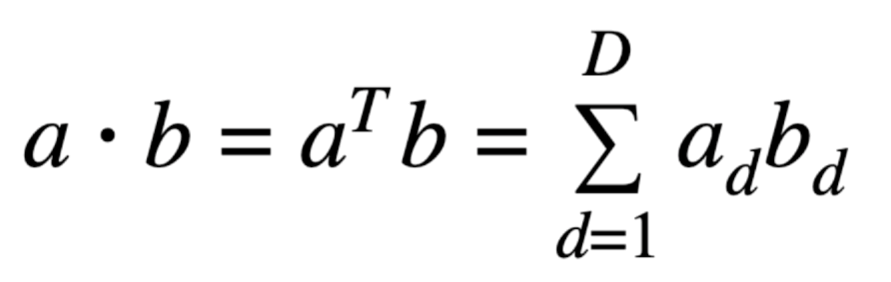
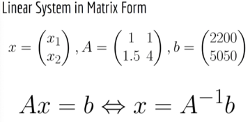
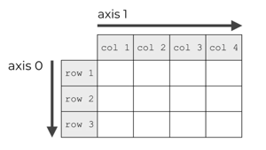
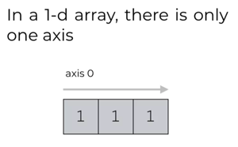
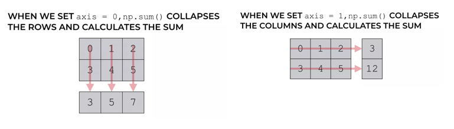
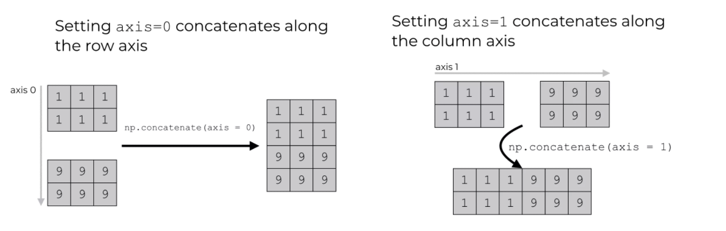

# Numpy basics

Numpy is a library for linear algebra and a bit of probability. The central object of numpy is the numpy array.

#### Key conventions
In Linear algebra there is a convention of treating vectors as Nx1 matrices (i.e. a 2D object).
In numpy most of the time vectors will be 1D (i.e Nx0)

Python Lists ARE NOT NP arrays. Operations don't generally behave in the same way on both. A list is a generic data 
structure whereas a NP array is a structure specifically to do Math operations.

## NP array creation
```python
import numpy as np

# We will be using a list as comparison
list = [1, 2, 3]

array1d = np.array([1, 2, 3]) # from a list creates a 1D vector
array1d.shape # (3,) 
array2d = np.array([[1,2], [3,4]]) # 2D matrix
array2d.shape # (2, 2)

# Converting back to list
array2d.tolist() # [[1, 2], [3, 4]]
```

Note that numpy has a `numpy.matrix` module which is a specialized 2D object. Np arrays can be N-dimensional
and therefore can also represent 2D matrixes.  As of Apr 2022 `numpy.matrix` is [no longer recommended for use](https://numpy.org/doc/stable/reference/generated/numpy.matrix.html).

## Adding elements to an array
```python
list.append(4) # [1, 2, 3, 4] mutates the original list
list + [5] #[1, 2, 3, 4, 5] returns a new list
array1d.append(4) # DOES NOT WORK. Numpy arrays have fixed size!
```

## Array access
- Rows first, columns second

```python
array2d = np.array([[1,2], [3,4]])

# Both options below are equivalent
array2d[1, 1] # 4
array2d[1][1] # 4

# Accessing a row
row = array2d[1] # array([3, 4])
row.shape # (2,) NOTE THAT THIS RETURNS 1D VECTORS, as opposed to a (2,1) 2d matrix

# Accessing a column
column = array2d[:, 1] #  array([2, 4]
column.shape # (2,) NOTE THAT THIS RETURNS 1D VECTORS, as opposed to a (2,1) 2d matrix

# Accessing continuous portions of an NP array
bigArray2d = np.array([[1,2,3], [4,5,6], [7, 8, 9]])
# array([[1, 2, 3],
#        [4, 5, 6],
#        [7, 8, 9]])
bigArray2d[1:, 0:2] # `1:` means from row one till the end, `0:2` means from column 0 (inclusive) till column 2 (exclusive)
# array([[4, 5],
#        [7, 8]])

# Cherry-picking specific rows or columns
# Note that the returned rows / columns are in the order I specify. This is a key concept for sorting (more below)
bigArray2d[[2,0]]
# array([[7, 8, 9],  
#        [1, 2, 3]])
bigArray2d[:,[1,0]]
# array([[2, 1],
#        [5, 4],
#        [8, 7]])
```

## Scalar operations
Numpy does element wise operations against scalars. This is called numpy broadcasting
```python
array1d + 4 # array([5, 6, 7])
array2d + 4 # array([[5, 6], [7, 8]])

array1d * 4 # array([ 4,  8, 12])
array2d * 4 # array([[ 4,  8], [12, 16]])
# Note that the behaviour for lists is different than for np arrays. In lists multiplication causes repetition
list = [ 1, 2, 3]
list * 2 # [1, 2, 3, 1, 2, 3] 

array1d / 4 # array([0.25, 0.5 , 0.75])
array2d / 4 # array([[0.25, 0.5 ], [0.75, 1.  ]])

array1d ** 2 # array([1, 4, 9])
array2d ** 3 # array([[1, 8], [27, 64]])

array1d % 2 # array([1, 0, 1])
array2d % 3 # array([[1, 2], [0, 1]])

array2d == 0 # array([[False, False], [False, False]])
```

## Element-wise application of standard mathematical functions
Whenever you apply a function to a numpy array it is very likely that numpy will apply it element-wise.
```python
np.sqrt(array1d) # Out[33]: array([1.,  1.41421356, 1.73205081])
np.sqrt(array2d) # Out[34]: array([[1., 1.41421356], [1.73205081, 2.]])

np.log(array1d) # Out[35]: array([0., 0.69314718, 1.09861229])
np.log(array2d) # Out[36]: array([[0., 0.69314718], [1.09861229, 1.38629436]])

# Skipping the 2d versions for brevity. They work as you expect.
np.exp(array1d) # array([ 2.71828183,  7.3890561 , 20.08553692])
np.tanh(array1d) # array([0.76159416, 0.96402758, 0.99505475])

# ...and many other standard mathematical functions
```

### Element-wise application of arbitrary functions and lambdas

```python
import numpy as np

array2d = np.array([[1,2], [3,4]])

# Case 1: when the transformation is done with operations already supported by numpy
# Direct application of a function made of supported scalar operations
def isDivisibleBy3(array):
    return array % 3 == 0 # These operations HAVE to be chains of scalar operations supported by np arrays
isDivisibleBy3(array2d)

# Using a Python lambda with supported scalar operations
l_isDivisibleBy3 = lambda array:array % 3 == 0
l_isDivisibleBy3(array2d) 

# Case 2: when the transformation is not made of supported numpy operations
# Using np.vectorize to vectorize any named function
def stringify(element):
    return str(element)

vectorized_stringify = np.vectorize(stringify)
vectorized_stringify(array2d) # array([['1', '2'], ['3', '4']], dtype='<U1')
```

## Vector to Vector and Matrix to Matrix element-wise operations
Numpy verifies that the shape of the vectors of matrixes involved make sense and throws an error if not
```python
vector1 = np.array([1,2,3])
vector2 = np.array([4,5,6])
vector3 = np.array([1,2])
vector1 + vector2 # array([5, 7, 9])
vector1 + vector3 # ValueError: operands could not be broadcast together with shapes (3,) (2,)
vector1 * vector2 # array([ 4, 10, 18])
vector1 / vector2 # array([0.25, 0.4 , 0.5 ])
```

## Vector Operations
### Dot Product of Vectors 
Element-wise multiplication and then summation of all elements in two vectors **OF THE SAME SIZE**.



```python
import numpy as np

a = np.array([1,2])
b = np.array([3,4])

a.dot(b) # 11
np.dot(a,b) # 11
a @ b # 11 @ is available in the newer versions of numpy

```

### Magnitude (aka norm) and cosine similarity of vectors
The linear algebra functionality in numpy is located within the `np.linalg` module
The cosine similarity is derived from the geometric definition of the dot product:

```
a.b = |a|*|b|* cos(theta)
cos(theta) here is the cosine similarity. 1 means extremelly similar (identical), 0 means orthogonal vectors,
-1 means opposite vectors.
```

```python
vec1 = np.array([1,2,3,4,5])
vec2 = np.array([1,2,3,5,5])
norm1 = np.linalg.norm(vec1) # 7.416198487095663
norm2 = np.linalg.norm(vec2) # 8.0
cos = vec1.dot(vec2) / (norm1 * norm2) # 0.994444797133282
```


## Matrix operations

```python
# TRANSPOSE
import numpy as np

array2d = np.array([[1, 2, 3], [4, 5, 6]])
array2d.shape  # (2, 3)
transposed = array2d.T
# array([[1, 4],
#       [2, 5],
#       [3, 6]])
transposed.shape  # 3, 2)

# MATRIX MULTIPLICATION
mat1 = np.array([[1, 2, 3], [4, 5, 6]])  # (2,3)
mat2 = np.array([[1, 2, 3, 4], [5, 6, 7, 8], [9, 10, 11, 12]])  # (3,4)
mat3 = np.array([[1, 2], [3, 4]])  # (2,2)

mat1.dot(mat2)
mat1 @ mat2  # Equivalent to above
# array([[ 38,  44,  50,  56],
#        [ 83,  98, 113, 128]])
# Result of shape (2, 4)

mat1.dot(mat3)  # Will throw ERROR. Dimensions do not match

# DETERMINANT
np.linalg.det(mat1)  # ERROR: only square matrixes have determinants
np.linalg.det(mat3)  # -2.0000000000000004

# INVERSE
np.linalg.inv(mat1)  # ERROR: non-square matrix
np.linalg.inv(mat3)
# array([[-2. ,  1. ],
#       [ 1.5, -0.5]])
mat3 @ np.linalg.inv(mat3)
# array([[1.00000000e+00, 1.11022302e-16],
#        [0.00000000e+00, 1.00000000e+00]])  Inversion of a matrix is a numerical operation

# DIAGONAL OPERATIONS
# There is a gotcha when you use the np.diag operation in matrix vs a vector
# 1. np.diag in a matrix returns the diagonal elements of a matrix a s a vector
np.diag(mat3)  # array([1, 4])
# 2. np.diag on a vector creates a diagonal matrix using the numbers in the diagonal
np.diag([6, 7])
# array([[6, 0],
#        [0, 7]])

# EIGENVALUES AND EIGENVECTORS
np.linalg.eig(mat3)
#  We get a Python tuple
# ( array([-0.37228132,  5.37228132]),   => The eigenvalues
#   array([[-0.82456484, -0.41597356],   => The eigenvectors organised into a matrix AS COLUMN vectors
#          [ 0.56576746, -0.90937671]]) )

# COMPARISON OF TWO ARRAYS
shouldBeIdentity = mat3 @ np.linalg.inv(mat3)
# Element-wise comparison
shouldBeIdentity == np.identity(2) # Equivalent of np.equal(arr1, arr2)
# array([[False, False],
#        [ True, False]])

# Overall array to array comparison using `==` under the good (all elements must match exactly)
np.array_equal(shouldBeIdentity, np.identity(2)) # False

# Compare using a numerical tolerance 
# You can adjust the tolerance with an argument
# This is the best option after doing operations since there are a lot of operations that are numerical.
np.allclose(shouldBeIdentity, np.identity(2)) # True
```

### Solving linear systems


```python
import numpy as np

A = np.array([[1, 1], [1.5, 4]])
b = np.array([2200, 5050])
# You can solve a linear system analytically with the inverse. HOWEVER, THIS IS VERY INEFFICIENT COMPUTATIONALLY
x = np.linalg.inv(A) @ b # INEFFICIENT, DON'T USE IT
x2 = np.linalg.solve(A, b) # More efficient
```

## Generating Data
Why we need this?
- Initializing ML parameters to some value to start the training process
- Generate synthetic data to test an algorithm
- Generate random numbers from a distribution
```python
import numpy as np

# ARRAYS OF THE SAME NUMBER 
np.zeros((2,3))
# array([[0., 0., 0.],
#        [0., 0., 0.]])
np.ones((2,3))
# array([[1., 1., 1.],
#        [1., 1., 1.]])
# Array of any arbitrary number
np.ones((2,3)) * 13 
# array([[13., 13., 13.],
#        [13., 13., 13.]])

# IDENTITY AND DIAGONALS
np.eye(3)
np.identity(3) # equivalent
# array([[1., 0., 0.],
#        [0., 1., 0.],
#        [0., 0., 1.]])

np.diag([1,2])
# array([[1, 0],
#        [0, 2]])

# Sequences and Linear intervals
np.arange(2, 10, 2) # start, stop, step . Numbers are generated in the range [start, stop)
# array([2, 4, 6, 8])

np.linspace(20, 30, num = 5) # 5 linearly spaced numbers between 20 and 30 inclusive on both sides
#  array([20. , 22.5, 25. , 27.5, 30. ])
starts = np.array([20,50])
ends = np.array([30,60])
np.linspace(starts, ends, num = 5) # Runs 2 independent linspace sequences returning each sequence as a column in an array
# array([[20. , 50. ],
#        [22.5, 52.5],
#        [25. , 55. ],
#        [27.5, 57.5],
#        [30. , 60. ]])

np.logspace(10, 30, num=5, base=10) # Logarithmic spacing between base**start and base**stop 
# array([1.e+10, 1.e+15, 1.e+20, 1.e+25, 1.e+30])
```

### Generating Random Numbers with the `np.random` module

```python
import numpy as np

# UNIFORM DISTRIBUTION RANDOM NUMBERS np.random.random()
# By default uses a uniform distribution between 0 and 1
np.random.random() # 0.9071094230239403
np.random.random((2, 3)) # Tuple of desired shape
# array([[0.05531528, 0.57214743, 0.14378213],
#        [0.02893566, 0.2315892 , 0.47474896]])

# == Gaussian / Normal distribution random numbers = np.random.normal(mean=0.0, variance=1.0, size=<None/int/tuple>)
np.random.normal() #-0.21947009128664352 By default it uses a mean=0 and var=1 normal distribution
np.random.normal(10, 2)  # 7.3672666330117735
np.random.normal(10, 2, size=3) # array([ 6.65422927, 11.83325161, 10.64707005])
np.random.normal(10, 2, size=(2,3))
# array([[13.81648762,  7.24662232,  8.26770387],
#        [ 8.60060987,  8.9609857 ,  9.64768672]])

# RANDOM INTEGERS = np.random.randint(low, high<exclusive>, size)
np.random.randint(0,10) # 6 => random integer between [0, 10) 
np.random.randint(0,10, size=5) #  array([5, 4, 5, 4, 8])
np.random.randint(0,10, size=(2,3)) # 2d array of random integers between [0, 10)
# array([[9, 1, 0],
#        [3, 7, 5]])

#  SAMPLING A RANDOM NUMBER FROM A 1D ARRAY = np.random.choice(a, size=None, replace=True, p=None)
# a: 1D array to sample from. Can also take a list
# size: number of elements to sample from `a`. If given a tuple, the shape sampled output is put into an array of such
#       shape.
# replace: sample with or without repeating already sampled observations. Good setting for when oversampling data. De
# p: the probabilities associated with each element in `a`. If not give, assumes uniform.
sample_from = np.random.randint(0,10, size=5)
weights = np.random.random(5)
probabilites = weights / weights.sum() # normalising so that they sum up to 1
np.random.choice(sample_from, p=probabilites) # 7
np.random.choice(sample_from, 2, p=probabilites) # array([1, 7])
np.random.choice(sample_from, (3,2), p=probabilites)
# array([[2, 7],
#        [2, 1],
#        [7, 1]])
```


## Descriptive statistics of arrays

```python
import numpy as np

arr = np.random.normal(10, 2, size=(20, 4))

# Descriptive statistics of the whole matrix
arr.mean()  # ~ 10
arr.max()  # 14.55 
# Others: arr.min() arr.sum() variance: arr.var(), standard deviation: arr.std()
# Also available as a top-level method
np.mean(arr)  # ~10

# argmax returns the index of the largest element in the array assuming a flattened 1D array.
# In some cases you may want to find the multidimensional index of the max. You can use unravel_index() for that.
# This function is much more interesting when applied over an axis (see below). 
# argmin also exists
arr2 = np.array([[0, 10, 5], [500, 3, 2]])
arr2.argmax()  # 3
np.unravel_index(arr2.argmax(), arr.shape) # (1, 0)
```

## Numpy array axes and operations along axes 
Imagine you have a 2D array that represents a table of data with observations as rows and features as columns.
Often we want to apply operations either along the rows or along the columns of the array. In numpy this can be
controlled by specifying the `axis` parameter on the function you are calling. 

This idea of axes as rows and columns can also be extended to higher dimensional data, but we will keep it easy for now.

The convention for axes indexing is shown below. Notice that 1D arrays **only have one axis (axis=0)**. It is common
pitfall for people to confuse `axis=0` in a 2d array (i.e rows) with `axis=0` in a 1D array 
(no such thing as rows or colums in a 1D array).




### Operations along axes
**Each operation has a different behaviour when you specify which axis to apply it over**. This is also a common pitfall.

#### Sum, mean, standard deviation, max, argmax, and others
In these operations the axis argument refers to the axis that is going to be **COLLAPSED**. This is somewhat counter-intuitive.



```python
import numpy as np

arr = np.array([[0,1,2], [3,4,5]])
# array([[0, 1, 2],
#        [3, 4, 5]])
arr.sum(axis=0) # array([3, 5, 7])
arr.mean(axis=0) # array([1.5, 2.5, 3.5]
arr.max(axis=0) # array([3, 4, 5])

arr.sum(axis=1) # array([ 3, 12])
arr.mean(axis=1) # array([1., 4.])
arr.max(axis=1) # array([2, 5])

arr2=np.array([[0,10,5],[500,3,2]])
# array([[  0,  10,   5],
#        [500,   3,   2]])
arr2.argmax(axis=0) 
# array([1, 0, 0]) => The position in the 2 rows being collapsed of the maximum number per column (500, 10 and 5)
arr2.argmax(axis=1)
# array([1, 0]) => The position in the 3 columns being collapsed of the maximum number per row (10 and 500)
```

#### Concatenating and Splitting Arrays



```python
import numpy as np

# CONCATENATION
# Concatenation of 1D to 1D arrays
a1d = np.array([1,2])
b1d = np.array([3,4])
np.concatenate((a1d,b1d)) #  array([1, 2, 3, 4]) Note that the vectors to concatenate are passed in as a tuple

# Concatenate 2D to 2D arrays
# The concatenation axis becomes important. Numpy checks that the dimensions make sense
a2x3 = np.array([[0,10,5],[500,3,2]])
b2x3 = np.ones((2,3))
c3x3 = np.array([[1,2,3],[4,5,6],[7,8,9]])
np.concatenate((a2x3, b2x3), axis=0) 
# array([[  0.,  10.,   5.],
#        [500.,   3.,   2.],
#        [  1.,   1.,   1.],
#        [  1.,   1.,   1.]])
np.concatenate((a2x3, b2x3), axis=1)
# array([[  0.,  10.,   5.,   1.,   1.,   1.],
#        [500.,   3.,   2.,   1.,   1.,   1.]])
np.concatenate((a2x3, c3x3), axis=0)
# array([[  0,  10,   5],
#        [500,   3,   2],
#        [  1,   2,   3],
#        [  4,   5,   6],
#        [  7,   8,   9]])
np.concatenate((a2x3, c3x3), axis=1) # ERROR: dimensions mismatch for concatenation

# Concatenate 2D to 1D arrays
# Reshape the 1D array into a 2D array to concatenate
a1d = np.array([1,2])
a2x3 = np.array([[0,10,5],[500,3,2]])
a1d.shape # (2,)
reshaped = a1d.reshape((2,1))
np.concatenate((reshaped, a2x3), axis=1)
# array([[  1,   0,  10,   5],
#        [  2, 500,   3,   2]])

# SPLIT
arr_to_split = np.arange(6*4).reshape((6,4))
# array([[ 0,  1,  2,  3],
#        [ 4,  5,  6,  7],
#        [ 8,  9, 10, 11],
#        [12, 13, 14, 15],
#        [16, 17, 18, 19],
#        [20, 21, 22, 23]])

# Remember you can also use array access to approximate split use cases 
top1 = arr_to_split[:3, :]
bottom1 = arr_to_split[3:, :]

# np.split() 
# Split via axis=0 (rows) in equal parts 
top2, bottom2 = np.split(arr_to_split, 2, axis=0) # Does not mutate original array
top2
# array([[ 0,  1,  2,  3],
#        [ 4,  5,  6,  7],
#        [ 8,  9, 10, 11]])
bottom2
# array([[12, 13, 14, 15],
#        [16, 17, 18, 19],
#        [20, 21, 22, 23]])

# Split via axis=1 (columns) in equal parts
left, right = np.split(arr_to_split, 2, axis=1)

# Split via axis=0 (rows) at specific splitting points
top3, mid3, bottom3 = np.split(arr_to_split, [2,5], axis=0) # Splits [:2], [2:5], [5:]. Returns empty array if splitting points are beyond axis dimension
top3
# array([[0, 1, 2, 3],
#        [4, 5, 6, 7]])
mid3
# array([[ 8,  9, 10, 11],
#        [12, 13, 14, 15],
#        [16, 17, 18, 19]])
bottom3
# array([[20, 21, 22, 23]]) 
bottom3.shape # (1,4) Notice that it does not convert it into a 1D array

# Split via axis=1 (columns) at specific splitting points
left3, mid3, right3 = np.split(arr_to_split, [2,3], axis=1)
```

## Sorting
In ML sorting a matrix by the numerical value of a column is very common.

```python
import numpy as np

# SORTING BY COLUMNS
arrToSort = np.array([[11, 12, 13, 22], [21, 7, 23, 14], [31, 10, 33, 7]])
# array([[11, 12, 13, 22],
#        [21,  7, 23, 14],
#        [31, 10, 33,  7]])
columnToSortBy = 1 # We want to sort by the second column


# This is tricky to understand, so we will spell it out first
valsInColumnToSort = arrToSort[:,columnToSortBy] # array([12,  7, 10])
sortingIndexes = valsInColumnToSort.argsort() # array([1, 2, 0])
sortedArr = arrToSort[sortingIndexes]  # this is cherry-picking certain rows by doing arrToSort[[1,2,0]] (see accessing arrays section above)
# valsInColumnToSort:    sortingIndexes:    sortedVector:                                                                
# 12,         ┌───────── 1,◀─────────────── 7,                   
#             │                                                  
# 7, ◀────────┘   ┌───── 2,◀─────────────── 10,                  
#                 │                                              
# 10 ◀────────────┘  ... 0 ◀─────────────── 12                   
#                                                                
#                                                                
# arrToSort:              sortingIndexes:    sortedArr:                                                                        
# [[11 12 13 22]    ┌──── 1, ◀───────────────[[21  7 23 14]      
#                   │                                            
#  [21  7 23 14] ◀──┘┌─── 2, ◀─────────────── [31 10 33  7]      
#                    │                                           
#  [31 10 33  7]]◀───┘    0  ◀─────────────── [11 12 13 22]]     
                                                               
# Now the evil-looking one-liner
sortedArr2 = arrToSort[arrToSort[:,columnToSortBy].argsort()]
```

Sorting by rows can be achieved in a similar way.