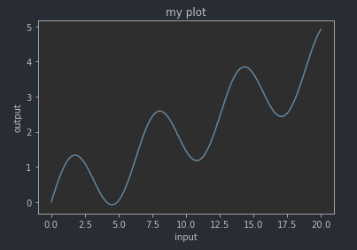
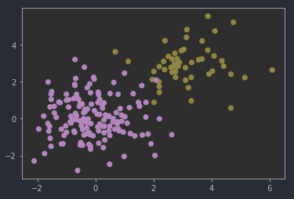
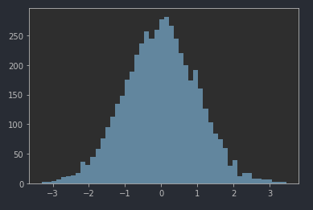
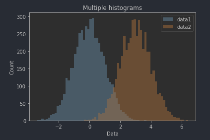
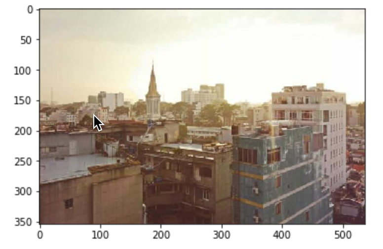
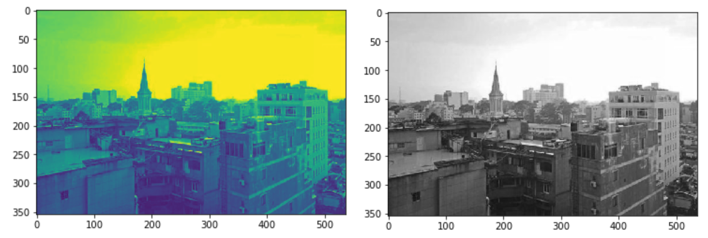
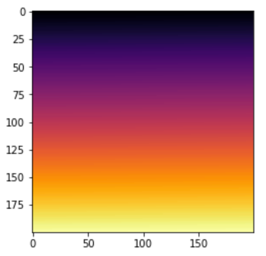

# Matplotlib basics

Matplotlib is a library to visualize data.
This section is about using matplotlib in the context of building ML algorithms.
It does not cover matplotlib content to build reports or presentations.

# Line charts
Despite their name, they are used to plot any kind of one-dimensional signal. For example: time
series or sound waves.

```python
import numpy as np
import matplotlib.pyplot as plt

# Dummy data
x = np.linspace(0, 20, 1000) # [0, ... 1000 points, 20]
y = np.sin(x) + 0.2 * x

plt.plot(x, y)
plt.xlabel('input')
plt.ylabel('output')
plt.title('my plot'); # semi-colon suppresses the output of plt.title() in the jupyter notebook result as it is irrelevant
# plt.show() # Needed if you are not inside a notebook to show the graph
```


# Scatter plots
Plot 2D data to visualise the geometric relationships between them. e.g. clustering plots.

```python
# Dummy data
X = np.random.randn(200, 2)
X[:50] += 3
Y = np.zeros(200)
Y[:50] = 1

plt.scatter(X[:,0], X[:,1], c=Y);
# first argument = first dimension, second arg = second dimension
# c means color. 
#   - It is optional. 
#   - It must be a one dimensional array of n-samples with integers representing a label
```


# Histograms
Lets us see the distribution of our data.

## Simple histogram
```python
X1 = np.random.randn(5000) # Dummy data
plt.hist(X1, bins=50);
```


## Overlapping Histograms

```python
# Dummy Data
X1 = np.random.randn(5000)
X2 = np.random.randn(5000) + 3

plt.hist(X1, bins=50, alpha=0.5, label="data1")
plt.hist(X2, bins=50, alpha=0.5, label="data2")
plt.xlabel("Data")
plt.ylabel("Count")
plt.title("Multiple histograms")
# the `label` attributes don't get shown unless legend is specified
plt.legend(loc='upper right');
```



# Plotting images

```python
# To open images into python we can use a library called Pillow
from PIL import Image
im = Image.open('img/section-3-matplotlib/dummy-image.jpeg')
type(im) # PIL.JpegImagePlugin.JpegImageFile

# PIL images can be converted to their np array representation
image_as_array = np.array(im)
image_as_array.shape  # (354, 536, 3) image h, image w, RGB channels

# Use imshow to show images
plt.imshow(image_as_array)
plt.imshow(im) # Both produce the same result
```



## Converting images to black and white
```python
# It is very common to work with black and white images in computer vision tasks.
# A common way of converting a color image to B&W is to take the average of the RGB dimensions of the image
bw_image_as_array = image_as_array.mean(axis=2)
bw_image_as_array.shape # (354, 536) => This has lost the 3rd dimension

# The first command may show the image in some weird shades of green. This is because it is up to matplot lib to 
# assign which colour to show for an "image" that only has one channel.
# The cmap argument is used to control the color map that matplotlib will use.
plt.imshow(bw_image_as_array)
plt.imshow(bw_image_as_array, cmap='gray')

```



# Heatmaps
A heatmap is nothing more than an image visualization of 2D data.
```python
dummy_data = np.arange(0, 200 * 200, 1).reshape((200,200))
plt.imshow(dummy_data, cmap="inferno")
```


More complete instructions [in the docs](https://matplotlib.org/stable/gallery/images_contours_and_fields/image_annotated_heatmap.html).
