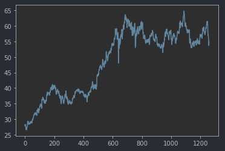
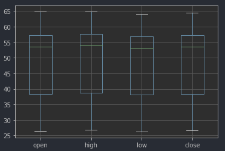
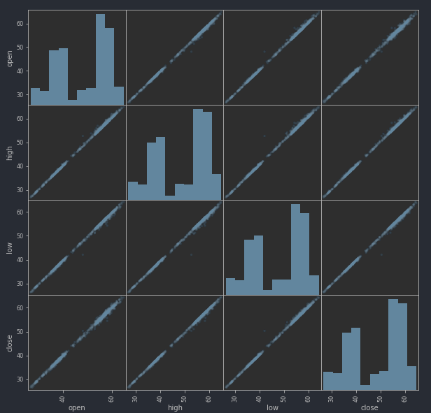

# Pandas basics

Pandas is particularly useful for data that is structured as a table.
It is less useful for other data formats likes images and unstructured text. 

# Reading Data
Pandas has functions to read from a CSV or an Excel file
```python
import pandas as pd

df = pd.read_csv("assets/section-4-pandas/sbux.csv")
df = pd.read_csv("https://foo.bar") # also works for reading from a URL
# If your data does not come with column names, you can assign them yourself at readtime
df = pd.read_csv("assets/section-4-pandas/sbux.csv", names=['DATE', 'OPEN', 'HIGH', 'LOW', 'CLOSE', 'VOLUME', 'NAME'])
```

# Dataframe indexes
Every dataframe has an index. You can specify which column should be the index at read time.
If you don't specify anything, Pandas will assign a default index using the element position.
```python
df = pd.read_csv("assets/section-4-pandas/sbux.csv")
#  this becomes the default index
# ^        date   open    high    low   close   volume  Name
# 0  2013-02-08  27.92  28.325  27.92  28.185  7146296  SBUX
# 1  2013-02-11  28.26  28.260  27.93  28.070  5457354  SBUX

df = pd.read_csv("assets/section-4-pandas/sbux.csv", index_col='date')
#              open    high    low   close   volume  Name
# date <-index                                                
# 2013-02-08  27.92  28.325  27.92  28.185  7146296  SBUX
# 2013-02-11  28.26  28.260  27.93  28.070  5457354  SBUX
```

# Understanding the structure of the data
```python
# All of these give a preview of some samples in the data
df.head()
df.head(10)
df.tail()
df.tail(10)

df.columns
df.info()
# RangeIndex: 1259 entries, 0 to 1258
# Data columns (total 7 columns):
#  #   Column  Non-Null Count  Dtype
# ---  ------  --------------  -----
#  0   date    1259 non-null   object
#  1   open    1259 non-null   float64
#  2   high    1259 non-null   float64
#  3   low     1259 non-null   float64
```

## Replacing column names in a dataframe
```python
df.columns # Index(['date', 'open', 'high', 'low', 'close', 'volume', 'Name'], dtype='object')
df.columns = ['date', 'open', 'high', 'low', 'close', 'volume', 'name']
```

# Select Rows and Columns in a dataframe

IMPORTANT: Pandas is a "columns first" library. That doing **column** operations like retrieving all values for a single 
column is very efficient. That also means that doing **row** operations like filtering rows is not very efficient.

axis=0 in pandas means columns and axis=1 means rows 

```python
# df[0,0] ERROR! PANDAS DATAFRAMES ARE NOT INDEXED LIKE NUMPY ARRAYS

# SELECTING COLUMNS
df['open'] # Returns an object of type pandas.Series. 
df[['open', 'close']] # Returns an object of type pandas.DataFrame
df[['open']] # Returns an object of type pandas.DataFrame

# SELECTING SPECIFIC ROWS
df.iloc[2] # Looks for a row using the position in the dataframe starting from 0. Type Series
df.loc["2013-02-22"] # Looks for a row using the index column. Type Series

# SELECTING ROWS BASED ON A CONDITION
# The [] operator accepts a Series of Booleans as arguments to indicate which rows to select.
# Note the operator abuse. df['open'] selects columns but df[series_of_booleans] selects rows
rows_that_comply_with_condition = df['open'] > 64 # Series[False, False, True, ...]
df[rows_that_comply_with_condition] # Returns only the rows that have True in rows_that_comply_with_condition
df[df['open'] > 64] # You would usually see it written like this
```

# Converting Dataframes into Numpy Arrays
```python
# df.values returns a numpy array THAT DOES NOT INCLUDE THE INDEX. If the dataframe contains a non-numeric column,
# the numpy array will be of type object. This is usually not what you want if you are feeding this into an ML algorithm.
df.values  
```

# Writing to a file
```python
df.to_csv('output.csv') # Will include the column names by default and the index column
df.to_csv('output.csv', index=False) # Will not include the index column
```

# Applying / Mapping a function to each row in a dataframe
```python
# APPLY A FUNCTION TO EVERY ROW IN A DATA FRAME
# If you are doing simple arithmetic or boolean operations between columns the operators are applied row by row
df['open']**2
df['open'] - df['close']

# If you need to apply an arbitrary python function on each row
# The function you want to map
def date_to_year(row):
    return int(row['date'].split('-')[0])
result = df.apply(date_to_year, axis=1) # axis=1 means apply through the rows
# Returns a Pandas Series containing Series(2013, 2014, ...)

# ADD A DERIVED COLUMN TO A DATAFRAME
# It is very common to manipulate some column in a DF and add the result as a new column
df['open**2'] = df['open']**2
df['open-close'] = df['open'] - df['close']
df['year'] = df.apply(date_to_year, axis=1)
```

# Get descriptive statistics of the columns
There are several ways of doing this
```python
df[['open', 'high', 'low']].describe()
#              open         high          low
# count  1259.000000  1259.000000  1259.000000
# mean     48.344296    48.717212    47.956827
# std      10.389108    10.458485    10.304082
# min      26.535000    26.820000    26.260000
# 25%      38.372500    38.690650    38.087750
# 50%      53.520000    53.995000    53.180000
# 75%      57.270000    57.735000    56.850000
# max      64.850000    64.870000    64.180000

df[['open', 'high', 'low']].mean() # Series(open: 48.3, high: 48.71, low: 78.9)
df[['open', 'high', 'low']].max()
df[['open', 'high', 'low']].min()
df[['open', 'high', 'low']].quantile(q=0.75)
```
# Plotting with Pandas

## Histogram
```python
df['open'].hist();
```


## Line chart
```python
df['open'].plot();
```


## Box Plot
- Box plots are often used to compare and contrast the same variable in two groups, 
like the height distribution difference between men and women in a sample
- The box represents q1=0.25 and q3=0.75, the green line is the median (q2=0.5).
- The distance `q3-q1` is called the Interquartile Range (IQR)
- Usually, anything above `q3 + 1.5*IQR` or below `q1-1.5*IQR` is considered an outlier 
- The whiskers represent one of two things:
  - The max or min value if there are no outliers
  - `q3 + 1.5*IQR` or `q1-1.5*IQR` if there are outliers
- A good video explaining boxplots can be [seen here](https://www.youtube.com/watch?v=INSIyaZUXIY)
```python
df[['open', 'high', 'low', 'close']].boxplot();
```


## Scatter matrix
- The diagonal contains a histogram of each variable
- The other plots show the pair-wise relationship between the variables
- If you are wondering why a plot that should be symmetric does not look symmetric [go here](https://stats.stackexchange.com/questions/487150/correlation-is-a-symmetric-measure-but-scatter-plot-matrix-shows-asymmetric-dep#:~:text=Conclusion%3A%20It's%20common%20that%20scatterplot,correlation%20between%20variables%20have%20changed.)
```python
from pandas.plotting import scatter_matrix

scatter_matrix(df[['open', 'high', 'low', 'close']], alpha=0.2, figsize=(10,10));
```


