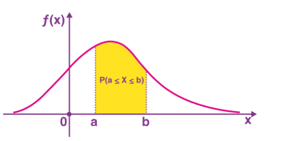
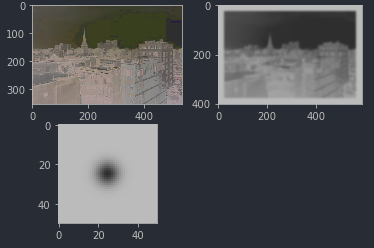

# SciPy

SciPy extends Numpy by adding functionality for advanced statistics beyond what numpy already has, 
signal processing, computer vision among other things.

# Probability Density Functions (PDF) and Cumulative Density Functions (CDF)
We are going to show how to calculate these under the normal distribution but 
these concepts apply to any continuous distribution so go to the docs for more info.

A small refresher:
The PDF is a function that describes how a **continuous** random variable is distributed.

PDFs are typically used to calculate the probability of the random variable being within a range.
For example `P(3mm < X: mm of rain tommorow < 4mm)`. That probability equates to the area under the curve
for that range.
- The probability of a random variable being **exactly** something is 0 (there is no area under the curve for a line).
- The total area under the curve for all possible values must be 1.
- A more complete [refresher here](# https://www.youtube.com/watch?v=Fvi9A_tEmXQ)

- 

CDFs are the "accumulated version" of the PDF. Following with the example above, a single point in the CDF means: 
the probability that tomorrow rains <= 4 mm is  `CDF(X=4mm)`

```python
import numpy as np
import matplotlib.pyplot as plt
# You can also import `beta` or `gamma` if you are interested in those distributions
from scipy.stats import norm

x = np.linspace(-6, 6, 1000)

fx = norm.pdf(x, loc=0, scale=1)  # locs=mean, scale=standard deviation
Fx = norm.cdf(x, loc=0, scale=1) # locs=mean, scale=standard deviation
plt.plot(x, fx)
plt.plot(x, Fx)
```

# Convolution
Convolution is a very common operation in fields like image analysis, signal processing, deep learning and statistics
Here we illustrate how to do convolution with sciPy by applying a gaussian blur filter to an image.

```python
from PIL import Image
import numpy as np
import matplotlib.pyplot as plt
from scipy.stats import norm
from scipy.signal import convolve2d

# 1) Dummy image is made gray scale
im = Image.open('img/section-3-matplotlib/dummy-image.jpeg')
gray = np.mean(im, axis=2)

# 2) Create a gaussian blur filter by hand
x = np.linspace(-6, 6, 50) # The filter will involve a box of 50 x 50 pixels at a time
fx = norm.pdf(x, loc=0, scale=1) # This is a 1D  filter with 50 pixes
# A gaussian blur filter is a 2D spherical filter. Let's turn it into a 2D gaussian function
filter = np.outer(fx, fx) # `filter` is a discrete table the 2D normal with 50x50 entries


# 3) Actual application of the convolution between image and filter
# Applies the 50x50 filter over the image. It auto adds padding in the edges.
# We work with a B&W image because we are dealing with a 2D filter. You can only convolve functions in the same dimension
blurred_image = convolve2d(gray, filter)
plt.subplot(2,2,1)
plt.imshow(im, cmap='gray');
plt.subplot(2,2,3)
plt.imshow(filter, cmap='gray');
plt.subplot(2,2,2)
plt.imshow(blurred_image, cmap='gray');
```
