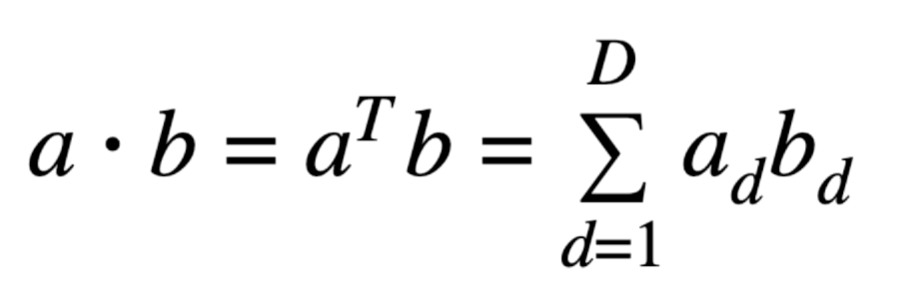
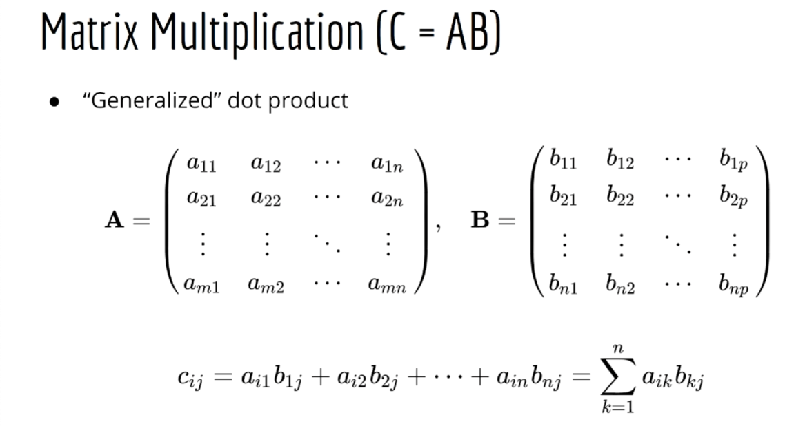
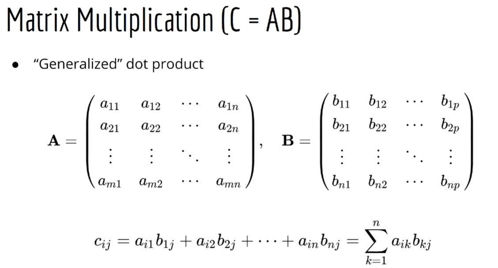

# Numpy basics

Numpy is a library for linear algebra and a bit of probability. The central object of numpy is the numpy array.

#### Key conventions
In Linear algebra there is a convention of treating vectors as Nx1 matrices (i.e. a 2D object).
In numpy most of the time vectors will be 1D (i.e Nx0)

## Common operations used in ML

### Dot product

Element-wise multiplication and then summation of all elements in two vectors **OF THE SAME SIZE**.

### Matrix Multiplication

### Element-wise Matrix Product

### Solve Linear Systems

### Invert a Matrix

### Find a daterminant |A|

### Choosing a random number
Choosing at random from a distribution (e.g. Uniform, Gaussian)
