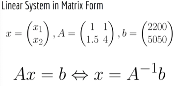

# Numpy basics

Numpy is a library for linear algebra and a bit of probability. The central object of numpy is the numpy array.

#### Key conventions
In Linear algebra there is a convention of treating vectors as Nx1 matrices (i.e. a 2D object).
In numpy most of the time vectors will be 1D (i.e Nx0)

Python Lists ARE NOT NP arrays. Operations don't generally behave in the same way on both. A list is a generic data 
structure whereas a NP array is a structure specifically to do Math operations.

## NP array creation
```python
import numpy as np

# We well be using a list as comparison
list = [1, 2, 3]

array1d = np.array([1, 2, 3]) # from a list creates a 1D vector
array1d.shape # (3,) 
array2d = np.array([[1,2], [3,4]]) # 2D matrix
array2d.shape # (2, 2)

# Converting back to list
array2d.tolist() # [[1, 2], [3, 4]]
```

Note that numpy has a `numpy.matrix` module which is a specialized 2D object. Np arrays can be N-dimensional
and therefore can also represent 2D matrixes.  As of Apr 2022 `numpy.matrix` is [no longer recommended for use](https://numpy.org/doc/stable/reference/generated/numpy.matrix.html).

## Adding elements to an array
```python
list.append(4) # [1, 2, 3, 4] mutates the original list
list + [5] #[1, 2, 3, 4, 5] returns a new list
array1d.append(4) # DOES NOT WORK. Numpy arrays have fixed size!
```

## Array access
- Rows first, columns second

```python
array2d = np.array([[1,2], [3,4]])

# Both options below are equivalent
array2d[1, 1] # 4
array2d[1][1] # 4

# Accessing a row
row = array2d[1] # array([3, 4])
row.shape # (2,) NOTE THAT THIS RETURNS 1D VECTORS, as opposed to a (2,1) 2d matrix

# Accessing a column
column = array2d[:, 1] #  array([2, 4]
column.shape # (2,) NOTE THAT THIS RETURNS 1D VECTORS, as opposed to a (2,1) 2d matrix

# Accessing portions of an NP array
bigArray2d = np.array([[1,2,3], [4,5,6], [7, 8, 9]])
# array([[1, 2, 3],
#        [4, 5, 6],
#        [7, 8, 9]])
bigArray2d[1:, 0:2] # `1:` means from row one till the end, `0:2` means from column 0 (inclusive) till column 2 (exclusive)
# array([[4, 5],
#        [7, 8]])
```

## Scalar operations
Numpy does element wise operations against scalars. This is called numpy broadcasting
```python
array1d + 4 # array([5, 6, 7])
array2d + 4 # array([[5, 6], [7, 8]])

array1d * 4 # array([ 4,  8, 12])
array2d * 4 # array([[ 4,  8], [12, 16]])
# Note that the behaviour for lists is different than for np arrays. In lists multiplication causes repetition
list = [ 1, 2, 3]
list * 2 # [1, 2, 3, 1, 2, 3] 

array1d / 4 # array([0.25, 0.5 , 0.75])
array2d / 4 # array([[0.25, 0.5 ], [0.75, 1.  ]])

array1d ** 2 # array([1, 4, 9])
array2d ** 3 # array([[1, 8], [27, 64]])

array1d % 2 # array([1, 0, 1])
array2d % 3 # array([[1, 2], [0, 1]])

array2d == 0 # array([[False, False], [False, False]])
```

## Element-wise application of standard mathematical functions
Whenever you apply a function to a numpy array it is very likely that numpy will apply it element-wise.
```python
np.sqrt(array1d) # Out[33]: array([1.,  1.41421356, 1.73205081])
np.sqrt(array2d) # Out[34]: array([[1., 1.41421356], [1.73205081, 2.]])

np.log(array1d) # Out[35]: array([0., 0.69314718, 1.09861229])
np.log(array2d) # Out[36]: array([[0., 0.69314718], [1.09861229, 1.38629436]])

# Skipping the 2d versions for brevity. They work as you expect.
np.exp(array1d) # array([ 2.71828183,  7.3890561 , 20.08553692])
np.tanh(array1d) # array([0.76159416, 0.96402758, 0.99505475])

# ...and many other standard mathematical functions
```

### Element-wise application of arbitrary functions and lambdas

```python
import numpy as np

array2d = np.array([[1,2], [3,4]])

# Case 1: when the transformation is done with operations already supported by numpy
# Direct application of a function made of supported scalar operations
def isDivisibleBy3(array):
    return array % 3 == 0 # These operations HAVE to be chains of scalar operations supported by np arrays
isDivisibleBy3(array2d)

# Using a Python lambda with supported scalar operations
l_isDivisibleBy3 = lambda array:array % 3 == 0
l_isDivisibleBy3(array2d) 

# Case 2: when the transformation is not made of supported numpy operations
# Using np.vectorize to vectorize any named function
def stringify(element):
    return str(element)

vectorized_stringify = np.vectorize(stringify)
vectorized_stringify(array2d) # array([['1', '2'], ['3', '4']], dtype='<U1')
```

## Vector to Vector and Matrix to Matrix element-wise operations
Numpy verifies that the shape of the vectors of matrixes involved make sense and throws an error if not
```python
vector1 = np.array([1,2,3])
vector2 = np.array([4,5,6])
vector3 = np.array([1,2])
vector1 + vector2 # array([5, 7, 9])
vector1 + vector3 # ValueError: operands could not be broadcast together with shapes (3,) (2,)
vector1 * vector2 # array([ 4, 10, 18])
vector1 / vector2 # array([0.25, 0.4 , 0.5 ])
```

## Dot Product of Vectors 
Element-wise multiplication and then summation of all elements in two vectors **OF THE SAME SIZE**.

```python
import numpy as np

a = np.array([1,2])
b = np.array([3,4])

a.dot(b) # 11
np.dot(a,b) # 11
a @ b # 11 @ is available in the newer versions of numpy

```

## Magnitude (aka norm) and cosine similarity of vectors
The linear algebra functionality in numpy is located within the `np.linalg` module
The cosine similarity is derived from the geometric definition of the dot product:

```
a.b = |a|*|b|* cos(theta)
cos(theta) here is the cosine similarity. 1 means extremelly similar (identical), 0 means orthogonal vectors,
-1 means opposite vectors.
```

```python
vec1 = np.array([1,2,3,4,5])
vec2 = np.array([1,2,3,5,5])
norm1 = np.linalg.norm(vec1) # 7.416198487095663
norm2 = np.linalg.norm(vec2) # 8.0
cos = vec1.dot(vec2) / (norm1 * norm2) # 0.994444797133282
```


## Matrix operations

```python
# TRANSPOSE
import numpy as np

array2d = np.array([[1, 2, 3], [4, 5, 6]])
array2d.shape  # (2, 3)
transposed = array2d.T
# array([[1, 4],
#       [2, 5],
#       [3, 6]])
transposed.shape  # 3, 2)

# MATRIX MULTIPLICATION
mat1 = np.array([[1, 2, 3], [4, 5, 6]])  # (2,3)
mat2 = np.array([[1, 2, 3, 4], [5, 6, 7, 8], [9, 10, 11, 12]])  # (3,4)
mat3 = np.array([[1, 2], [3, 4]])  # (2,2)

mat1.dot(mat2)
mat1 @ mat2  # Equivalent to above
# array([[ 38,  44,  50,  56],
#        [ 83,  98, 113, 128]])
# Result of shape (2, 4)

mat1.dot(mat3)  # Will throw ERROR. Dimensions do not match

# DETERMINANT
np.linalg.det(mat1)  # ERROR: only square matrixes have determinants
np.linalg.det(mat3)  # -2.0000000000000004

# INVERSE
np.linalg.inv(mat1)  # ERROR: non-square matrix
np.linalg.inv(mat3)
# array([[-2. ,  1. ],
#       [ 1.5, -0.5]])
mat3 @ np.linalg.inv(mat3)
# array([[1.00000000e+00, 1.11022302e-16],
#        [0.00000000e+00, 1.00000000e+00]])  Inversion of a matrix is a numerical operation

# DIAGONAL OPERATIONS
# There is a gotcha when you use the np.diag operation in matrix vs a vector
# 1. np.diag in a matrix returns the diagonal elements of a matrix a s a vector
np.diag(mat3)  # array([1, 4])
# 2. np.diag on a vector creates a diagonal matrix using the numbers in the diagonal
np.diag([6, 7])
# array([[6, 0],
#        [0, 7]])

# EIGENVALUES AND EIGENVECTORS
np.linalg.eig(mat3)
#  We get a Python tuple
# ( array([-0.37228132,  5.37228132]),   => The eigenvalues
#   array([[-0.82456484, -0.41597356],   => The eigenvectors organised into a matrix AS COLUMN vectors
#          [ 0.56576746, -0.90937671]]) )

# COMPARISON OF TWO ARRAYS
shouldBeIdentity = mat3 @ np.linalg.inv(mat3)
# Element-wise comparison
shouldBeIdentity == np.identity(2) # Equivalent of np.equal(arr1, arr2)
# array([[False, False],
#        [ True, False]])

# Overall array to array comparison using `==` under the good (all elements must match exactly)
np.array_equal(shouldBeIdentity, np.identity(2)) # False

# Compare using a numerical tolerance 
# You can adjust the tolerance with an argument
# This is the best option after doing operations since there are a lot of operations that are numerical.
np.allclose(shouldBeIdentity, np.identity(2)) # True
```

### Solving linear systems


```python
import numpy as np

A = np.array([[1, 1], [1.5, 4]])
b = np.array([2200, 5050])
# You can solve a linear system analytically with the inverse. HOWEVER, THIS IS VERY INEFFICIENT COMPUTATIONALLY
x = np.linalg.inv(A) @ b # INEFFICIENT, DON'T USE IT
x2 = np.linalg.solve(A, b) # More efficient
```


## Common operations used in ML

### Solve Linear Systems


### Choosing a random number
Choosing at random from a distribution (e.g. Uniform, Gaussian)
